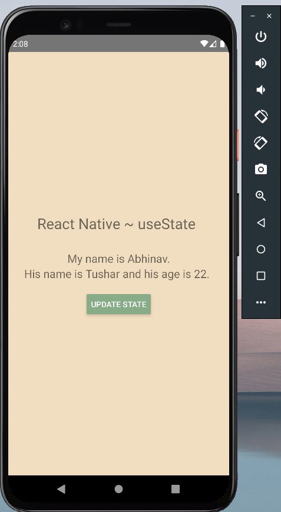
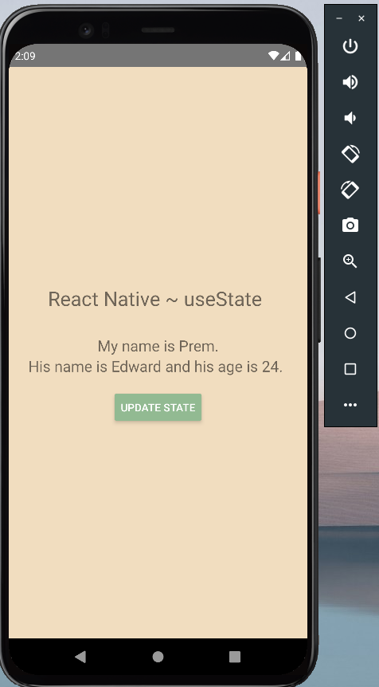

# myState
## This repository is about the "State" in React Native. A sample app.

### Screenshots:

### ``` Before State Change ```
<div align="center">
  
  </div>
  
### ``` After State Change ```
<div align="center">
  
  </div>

### ``` Video ```
https://user-images.githubusercontent.com/66355946/162158461-ae5a5a77-ee50-4788-9535-dd4827d9efd1.mp4
